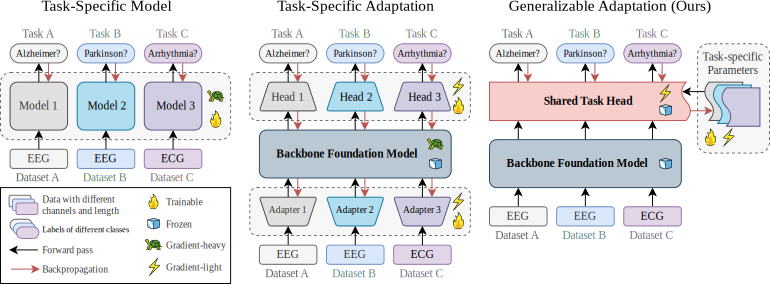
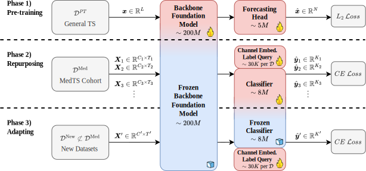
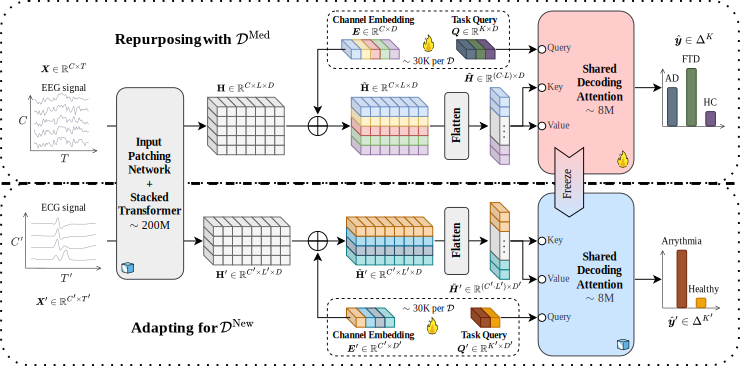

# _FORMED_: *Fo*undation Model *R*epuposed for *Med*ical Time Series Classification

_FORMED_ is a foundation model for medical time series classification, which **first achieves generalizable adaptation across different classification tasks**.

_FORMED_ is built and used in a three stage fashion:

1. First, we use a **pre-trained** general purpose large time series model, e.g. TimesFM, as backbone foundation model for time series pattern extraction.
2. Then we **repurpose** the model for medical time series classification with shared decoding attention mechanism.
3. Now the model can be easily applied to new datasets with limited labeled data for **adapting**.

